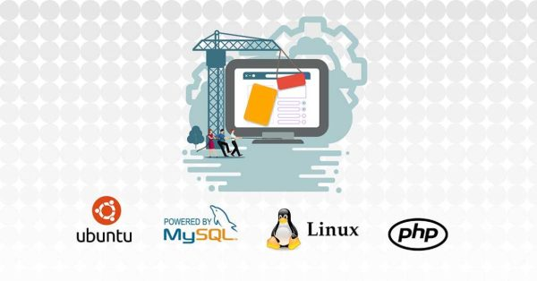

README.md
# project konecta
Konecta project ecommerce php



## Url de la aplicacion de ventas:
Cafeteria – [Sitio de WordPress](https://pruebakonectajonathan.azurewebsites.net/) para pruebas de ecommerce.  
Decidí usar WordPress 6.1.1 y woocommerce un gestor de contenidos escrito en php altamente usado en el mercado por mas del 60% del internet, por su estabilidad, seguridad y trayectoria, está montado en una Webapp en Azure Cloud ya que de esta forma se puede escalar tanto verticalmente como horizontalmente ademas de poder integrar HA, CDN, Replicacion y balanceadores de trafico por si se llegase a necesitar, esta webApp esta consumiendo los recursos de una base Linux Ubuntu con servicios como nginx, apache, php 7.4, mysql client y server, phpmyadmin.

## Datos ingreso a la gestion de la pagina y los productos:
[url de administracion](https://pruebakonectajonathan.azurewebsites.net/wp-admin/about.php)  
>user: jonsteve  
>pass: 274K95LnyHwXCFk  


## Datos ingreso a la gestion de la base de datos:
[url de administracion](http://pruebakonectajonathan.azurewebsites.net/phpmyadmin/)  
>user: imeodglrmd  
>pass: E64MLNTT252LACNP$

Realizar una consulta que permita conocer cuál es el producto que más stock tiene.  
``` SELECT * FROM `wp_wc_product_meta_lookup` ORDER BY `stock_quantity` DESC LIMIT 1;```  
Realizar una consulta que permita conocer cuál es el producto más vendido.  
``` SELECT * FROM `wp_wc_product_meta_lookup` ORDER BY `total_sales` DESC LIMIT 1;```  

Nota: No se es necesario la puesta en marcha debido a que ya está siendo hospedado y se encuentra desplegado en la infraestructura de azure, utilizando los links.

---

**Jonathan Torres Archbold**
